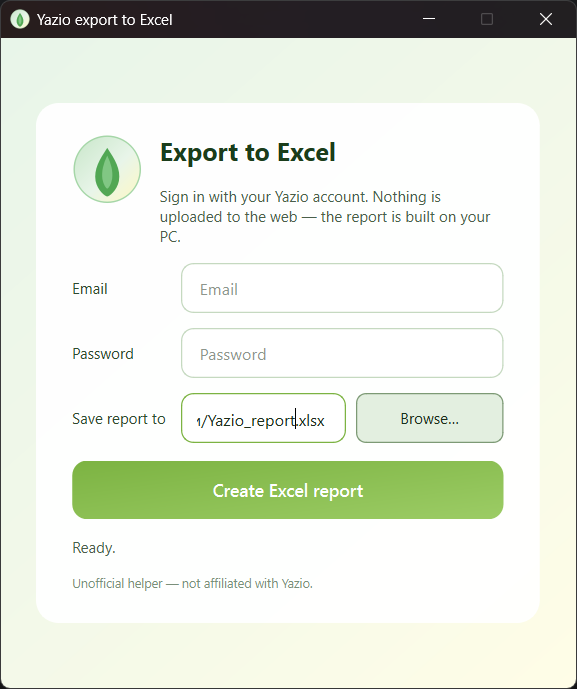
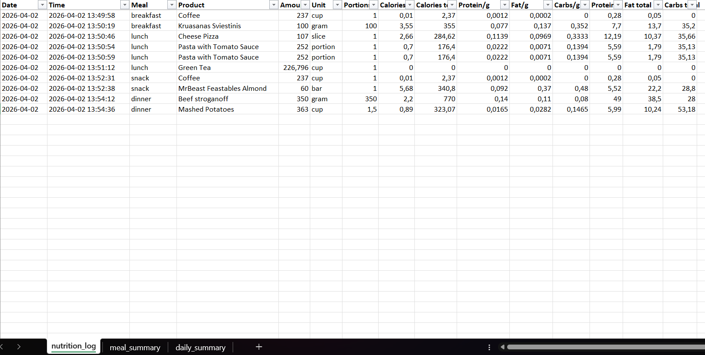
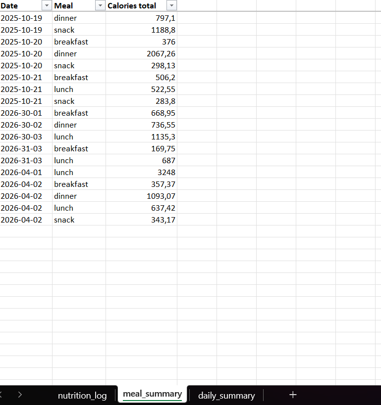
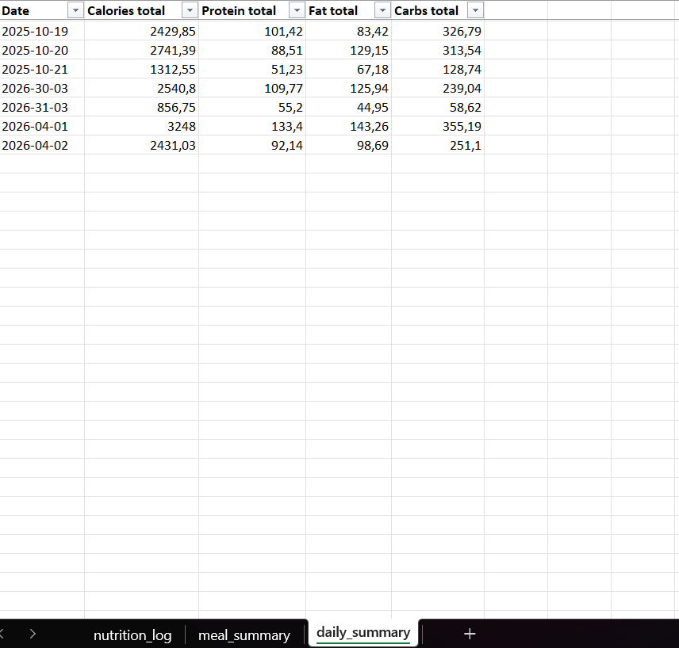

# Yazio Desktop Exporter

Desktop app for Windows that runs the [Yazio Exporter](https://github.com/funmelon64/Yazio-Exporter) pipeline and generates a single Excel workbook with nutrition data.

## What it does

- Provides a simple PySide6 desktop UI, so no manual terminal steps are required
- Exports data for a selected date range using your Yazio credentials
- Generates one `.xlsx` file with the following sheets:
  - `nutrition_log` — detailed food entries
  - `meal_summary` — aggregated meals
  - `daily_summary` — daily nutrition totals

## Screenshots

Main window:



Export result examples:

- `nutrition_log`  
  

- `meal_summary`  
  

- `daily_summary`  
  

## Quick start

### For users

1. Download the latest release `.exe` from the [Releases page](https://github.com/Glb-Lit/Yazio-exporter/releases/tag/v1.0.1)
2. Launch `YazioExporter.exe`
3. Enter your Yazio email and password
4. Choose the output folder in `Save report to` if needed
5. Click `Create Excel report`

After the export finishes, the generated Excel file will be saved to the selected folder.

## Developer setup

### Requirements

- Windows
- Python 3.11 or newer

### Installation

1. Download the release source archive from the [Releases page](https://github.com/Glb-Lit/Yazio-exporter/releases/tag/v1.0.1)
2. Install dependencies:

```bash
pip install -r requirements.txt
````

3. Start the desktop app:

```bash
python yazio_export.py
```

## Output

The app creates one Excel workbook with all records exported from the Yazio account connected to the entered credentials.

Workbook sheets:

* `nutrition_log` — detailed food entries
* `meal_summary` — food entries grouped by meal
* `daily_summary` — daily nutrition totals

## Project structure

* `app/main.py` — desktop app entry point
* `app/paths.py` — project root and `data/runtime/work` resolution for dev and frozen builds
* `app/ui/main_window.py` — PySide6 UI
* `app/services/export_service.py` — orchestration of the external exporter and report generation
* `app/services/parser_service.py` — JSON parsing and summary aggregation
* `app/services/excel_service.py` — single-workbook generation
* `data/runtime/work/` — local temporary workspace for exporter output

## Security and data handling

* Credentials are entered only in the app UI
* Credentials are not stored in repository files
* Temporary export data is kept in the local runtime workspace

## Disclaimer

This tool is not officially supported, affiliated with, or endorsed by Yazio.

It uses the [Yazio Exporter](https://github.com/funmelon64/Yazio-Exporter), an unofficial open-source utility, to access user data. Yazio does not provide public documentation for this export functionality, and the structure of exported data may change without notice.

Use at your own risk.

## Credits

Thanks to the open-source Yazio Exporter project for enabling data access.

## License

MIT
